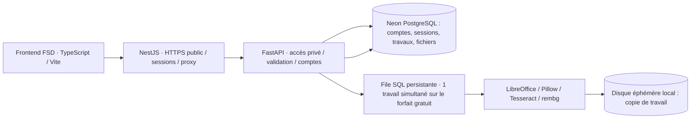

# Architecture



En développement, SQLite remplace Neon. Les cookies de session sont opaques, HttpOnly, SameSite=Lax et Secure en production. Seule l’empreinte de chaque session est stockée. Les mots de passe sont dérivés avec scrypt et sel aléatoire. Chaque accès à un travail ou à un fichier vérifie le propriétaire.

NestJS sert l’interface compilée et transmet les flux multipart sans charger les fichiers dans sa mémoire. FastAPI valide le secret interne ajouté par Nest, les origines des requêtes avec état, le type de fichier, la taille, les images décompressées et les archives bureautiques. Le moteur de traitement utilise des noms internes aléatoires et ne construit aucune commande shell avec le nom du fichier utilisateur.

## Feature-Sliced Design

```text
frontend/src/
  app/                         # bootstrap, routes, composition globale
  pages/                       # home, studio, background, documents, information
  widgets/header/              # navigation et compte affiché
  features/
    auth/                      # création de compte, connexion, profil
    document-conversion/       # import, choix de format, état des conversions
    photo-editor/              # cadrage, curseurs, export et planches
    background-removal/        # sélection de fond, comparaison, lots
    document-vault/            # recherche, filtres, aperçu, ZIP, relance
  entities/
    user/                      # session et identité
    document/                  # travaux, statuts, API et fichiers
    preset/                    # spécifications photo sourcées
  shared/
    api/                       # client HTTP générique
    lib/router.ts              # événements de navigation
    ui/                        # DOM, modales, notifications, utilitaires
```

Chaque slice expose son `index.ts`. Les imports descendent les couches ; pas d’import transversal entre features. La couche app compose les parcours, par exemple envoyer une photo du détourage vers le studio. `node scripts/check_fsd.mjs` vérifie ces frontières.

Les templates dans `frontend/pages/` sont produits depuis les HTML Stitch archivés dans `design/stitch/`. Leur mise en page et leurs assets sont conservés, leurs simulations remplacées par les fonctionnalités. `scripts/prepare_frontend.py` prépare les templates ; aucune clé Stitch n’est copiée dans le frontend.

## Déploiement initial

Un conteneur Render lance deux processus distincts : NestJS public, FastAPI sur loopback. Le service gratuit utilise un disque éphémère ; les originaux et exports sont donc rangés dans Neon en morceaux de 1 Mo et recopiés localement pendant leur traitement ou téléchargement. La capacité Neon gratuite est limitée : il ne s’agit pas d’un archivage illimité. Un stockage objet avec quota et sauvegardes est requis avant une ouverture à grande échelle. Le traitement est configuré à une tâche simultanée pour le forfait gratuit.

La configuration Google OAuth est facultative et nécessite les identifiants de l’exploitant et une URL de callback autorisée. La connexion email/mot de passe fonctionne indépendamment. Aucun envoi email ou compte Google n’est simulé.
